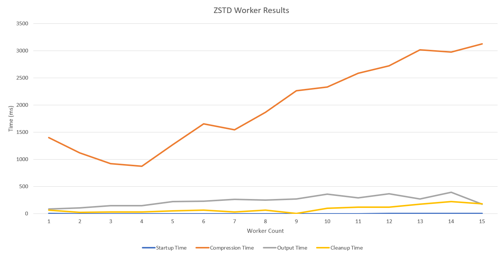

# Parallel ZSTD Compression

This is the second project for ECSE-4961. The goal of this project is to 
utilize multiple threads to compress a large input file using [zstd](http://facebook.github.io/zstd/). The input file is split into 16K byte chunks and distributed to each thread. 

## Installation and Execution


### Prerequisites

This project was created using `g++ v10.2.1-6` with the optional dependency of `GNU Make 4.3`. The [Old Dominion University](https://www.cs.odu.edu/~zeil/cs250PreTest/latest/Public/installingACompiler/) has some simple documentation on how to install `g++` depending on your operating system. Another requirement is `pthread` which handles the worker threads. This project also requires that `zstd` libraries have been installed. Linux based install instructions can be found at [the zstd repository](https://github.com/facebook/zstd#build-instructions)

### Downloading

This project can either be downloaded as a zip or cloned using the following git command:
```
git clone https://github.com/HonakerM/ECSE-4961.git
```


### Build

This project can be built using the `Makefile` by calling `make time`. Or by directly using `g++` with the following options:

```
g++ -std=c++11 -g *.cpp -o ./main.o -lzstd -pthread -D TIME_OUTPUT
```

### Execution

Once compiled tthhe compression can be executed by running the following command. 
```
./main.o <num_of_workers> <input_file> <output_file>
```

## Structure

### Worker Structure

Each worker is an instance of the `ZSTDWorker` class defined in `worker.h` and implemented in `worker.cpp`. The general logic flow for the worker is to first be instantiated by calling `ZSTDWorker(worker_id)` and then a seperate thread is created by calling `std::thread(&ZSTDWorker::compression_loop, worker);`. This starts the `compression_loop` which is an infinite loop that is waiting for data to compress. Data is passed to and received via `compress_chunk` and `get_compressed_chunk`.  

## Performance Analysis 

### Testing Methodology

The compression system will be benchmarked against the [silesia](http://sun.aei.polsl.pl/~sdeor/index.php?page=silesia) corpus and will test worker count from 1 to 15. Each worker count will be tested 5 times and then averaged. To use the automated testing suit first execute `scripts/get_corpus.sh` to download the `silesia` corpus and then run `scripts/test.sh` to automatically test the worker counts. Any graphs used in this report were created by hand.

### System Specifications

These results were gathered on a ubuntu 20.04 virtual machine with 2  Intel(R) Xeon(R) CPU E3-1220v5 with 1gb of DDR4 2133MHz

### Results 

| Startup Time | Compression Time | Output Time | Cleanup Time |
|--------------|------------------|-------------|--------------|
| 1.6          | 1401.4           | 89.6        | 66           |
| 0            | 1120.4           | 106.8       | 27           |
| 0.4          | 919.4            | 145.4       | 32.6         |
| 0            | 873.6            | 147.8       | 35           |
| 0            | 1271.4           | 223.6       | 51.2         |
| 0.2          | 1654.6           | 229         | 66.6         |
| 0            | 1543.2           | 262.8       | 31.8         |
| 0            | 1866.6           | 248.6       | 67.2         |
| 0            | 2262.8           | 271.2       | 7.2          |
| 0            | 2330.8           | 359.4       | 100.4        |
| 0            | 2583.4           | 294.8       | 120.4        |
| 2.6          | 2718.6           | 365.4       | 120.4        |
| 2.4          | 3013.4           | 272.4       | 172.6        |
| 1.8          | 2973.8           | 393.8       | 221.2        |
| 2.2          | 3124.6           | 352.2       | 185.4        |



As you can see in the above graph and table the compression time continously decreases in time upto 4 workers. After that the compression time steadly increases. This is most likely due to the CPU limited to 4 parrallel operations (one on each core) and anything over 4 starts to incur context switching costs. The best worker count is bound to the number of CPU cores avaible to the application. Another thing to note is that while the startup cost is generallyy static the cleanup time almost trippled between 1 and 15 workers.
