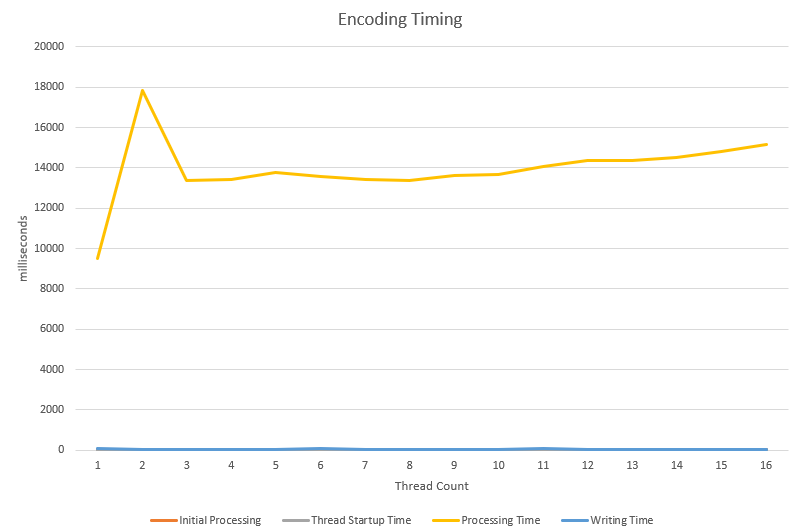
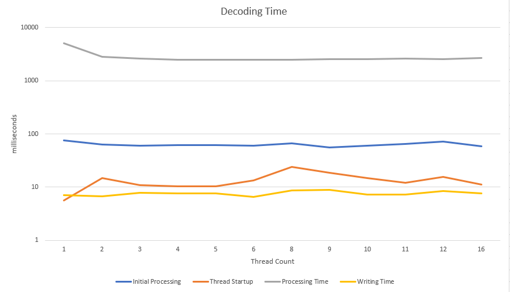
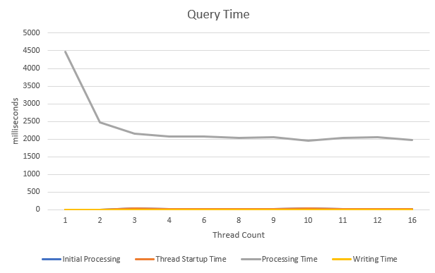

# Dictionary Encoder

  

This is the fourth project for ECSE-4961. The goal of this project is to create a multi threaded dictionary encoder. This dictionary encoder will be able to encode and decode text column data as well as query the number of keys in the encoded data.

  

## Installation and Execution

  
  

### Prerequisites

  

This project was created using `g++ v10.2.1-6` with the optional dependency of `GNU Make 4.3`. The [Old Dominion University](https://www.cs.odu.edu/~zeil/cs250PreTest/latest/Public/installingACompiler/) has some simple documentation on how to install `g++` depending on your operating system. Another requirement is `pthread` which handles the worker threads. 

  

### Downloading

  

This project can either be downloaded as a zip or cloned using the following git command:

```

git clone https://github.com/HonakerM/ECSE-4961.git

```

  
  

### Build

  

This project can be built using the `Makefile` by calling `make`. Or by directly using `g++` with the following options:

  

```

g++ -std=c++11 -msse -msse3 -O3 *.cpp -o ./main.o -pthread

```

  

### Execution

  

Once compiled tthhe compression can be executed by running the following command.

```
./main.o[-e|-d|-q query] -f <source_filename> -o <output_filename> [-t number_of_threads]
```
  

### Testing

There are three testing scripts provided inside of the `Makefile` by running one of the commands listed bellow you can test either encoding, decoding, or querying. Each script will test how the application scales between 1 and 16 threads. Each thread will be tested 5 times with the results averaged.
```
make test_encode
make test_decode
make test_query
```
These scripts except a column data file to exist at `files/Raw-Column-Data.txt` which can either be manually created or one can be auto generated using the following `make` command which is the same as running the python command bellow it.
```
# make
make create_data

# manually
python3 generate_column_data.py files/Raw-Column-Data.txt 200000 23574717 5 15
```


## Structure

### Encoding Table Structure

The encoding table is stored in an [std::unordered_map](https://en.cppreference.com/w/cpp/container/unordered_map) which is a hash table. For encoding each key is the string of characters with the value being the token while for decoding/querying it is the opposite.

### Encoded Data Structure
Encoded data can be split into two sections: `metadata` and `data`. The meta data is a list of keys each on their own line with the line number being the token. For example in the example file below `key1`'s token would be `1` while `key2` would be `2` and so on. 

```
key1
key2
key3
```
After the metadata section there is a file delimiter `|||||||||||||||`to let the worker know when the data section is done. The data section is an ordered list of binary encoded tokens aligned at 4 bytes where each token is a number. For example the above coding would produce the following data section (represented in hex):
```
000100020003
```


### Worker Structure

  

The bulk of the code is in the `worker.cpp` in the `DictionaryWorker` class.  The bulk of the each operation is handled in the `chunk` functions e.g. `encode_chunk`, `query_chunk`,`decode_chunk`  which are designed to be multi threaded
 using the `std::thread` class.  The other core function is the `file_op` function which orchestrates scheduling the threads and combining the output file.

  

## Performance Analysis

  

### Testing Methodology


The dictionary encoder will be benchmarked against a `247MB` byte file which contains `200000` unique keys , between 5 and 15 characters each. Finally there will be a total of `23574717` keys to encode. Each operation will be tested with thread counts ranging from 1 to 16 with 5 runs each for variation.
  

### System Specifications

  

These results were gathered on a ubuntu 20.04 virtual machine with 2 Intel(R) Xeon(R) CPU E3-1220v5 with 1gb of DDR4 2133MHz

  

### Results

The timing of the application was split into 4 categories with all timings in `ms`. The initial processing includes object creation and any metadata processing while thread_startup_time is the time to start jobs and assign work. The processing time is the most important metric and showcases how long the actual operation took. Finally the writing time is the time required to write to disk, this number should hopefully be constant. All results can be found in `results/timing_data.txt`


#### Encoding

| Thread Count | Initial Processing | Thread Startup Time | Processing Time | Writing Time |
|--------------|--------------------|---------------------|-----------------|--------------|
| 1            | 37                 | 3.6                 | 9490.6          | 65.4         |
| 2            | 27.8               | 3.6                 | 17823.6         | 57.2         |
| 3            | 28.2               | 5.2                 | 13375.2         | 60.8         |
| 4            | 25                 | 6.2                 | 13423.2         | 53.6         |
| 5            | 27.6               | 8.8                 | 13775.6         | 53.8         |
| 6            | 31.4               | 10.4                | 13562.4         | 65.8         |
| 7            | 25                 | 3.8                 | 13403           | 52.2         |
| 8            | 27                 | 16.6                | 13402           | 55.8         |
| 9            | 27.4               | 8                   | 13606.2         | 52           |
| 10           | 24.8               | 14.4                | 13663.4         | 53           |
| 11           | 27.6               | 14                  | 14073.6         | 66           |
| 12           | 26.8               | 17.6                | 14369.6         | 64           |
| 13           | 25.8               | 13.4                | 14373.8         | 58.2         |
| 14           | 28.2               | 13.2                | 14510.6         | 55           |
| 15           | 28.6               | 10.4                | 14823.6         | 59.8         |
| 16           | 27.2               | 12.8                | 15138.4         | 56.4         |





As the above image and table interestingly shows encoding initally gets much worse (2 threads is almost double the time) and then it settles at around a 36% performance decrease. This is caused because each encoding thread is required to acquire a `mutex` lock when adding keys to the hash table which in turns causes a problem known as [busy waiting](https://en.wikipedia.org/wiki/Busy_waiting). This could possibly be fixed by utilizing atomic operations on a custom built hash table but that was outside the scope of this project. The graph does not show a good representation of any of the other timings but they were largely inconsiquential. The inital processing and writing are constant as they're dependent on the data input size. As the table shows the thread startup time increases with thread count but it is marginal. 

 
#### Encoding Size

With the implmented encoding algorithm it is simple to calculate the encoded data size with the following equation `key*key_size + num_of_keys*4`. For the example data, which is 247 megabytes the resultant encoded data is only 96 megabytes! One way this encoding could produce better results is to create a variable length data alignment. Currently each token utilizes 4 bytes when all of the tokens could easily fit within 3 bytes which would reduce the size down by almost 23 megabytes! This variable length would need to be included inside the metadata and require rewriting the dataoutput which is outside of the scope of this project.  

#### Decoding

| Thread Count | Initial Processing | Thread Startup Time | Processing Time | Writing Time |
|--------------|--------------------|---------------------|-----------------|--------------|
| 1            | 76                 | 5.6                 | 5119.8          | 7            |
| 2            | 63                 | 15                  | 2815.2          | 6.8          |
| 3            | 61                 | 11                  | 2622.2          | 7.8          |
| 4            | 62.4               | 10.4                | 2490.2          | 7.6          |
| 5            | 62.4               | 10.4                | 2490.2          | 7.6          |
| 6            | 61                 | 13.4                | 2484.8          | 6.6          |
| 8            | 67                 | 24.2                | 2483.4          | 8.6          |
| 9            | 55.6               | 18.8                | 2525.2          | 9            |
| 10           | 60                 | 15                  | 2583.2          | 7.2          |
| 11           | 64.4               | 12.2                | 2593.8          | 7.2          |
| 12           | 71.8               | 15.6                | 2580.4          | 8.4          |
| 16           | 58.2               | 11.2                | 2692.2          | 7.6          |




Unlink encoding decoding greatly benifits from parallelization with the processing timing seeing a 200% increase in performance. The peformance maxes out around 4 threads due to that being the limit of cores on the CPU.  One thing to note is that the example data I was using was not easily devided by all thread counts and thus it was skipped. This same issue also affects querying

#### Querying

| Thread Count | Initial Processing | Thread Startup Time | Processing Time | Writing Time |
|--------------|--------------------|---------------------|-----------------|--------------|
| 1            | 2.2                | 2.2                 | 4470.6          | 0            |
| 2            | 2.6                | 2.6                 | 2463            | 0            |
| 3            | 29.6               | 29.6                | 2147.2          | 0            |
| 4            | 17.8               | 17.8                | 2066.2          | 0            |
| 6            | 16.4               | 16.4                | 2068            | 0            |
| 8            | 15.6               | 15.6                | 2040.4          | 0            |
| 9            | 13.6               | 13.6                | 2054            | 0            |
| 10           | 26.4               | 26.4                | 1962.4          | 0            |
| 11           | 14.6               | 14.6                | 2026.6          | 0            |
| 12           | 14.8               | 14.8                | 2046            | 0            |
| 16           | 17.4               | 17.4                | 1969.2          | 0            |




Similarly to decoding querying also sees a noticable improvement with threading. One thing to note is that `O(num_of_keys)` performance can be achived by including the count in the meta data but I thought that removed the real life comparison of general data operations. 


## Conclusion

Overall I believe that my dictionary encoder was a success. It performed reasonabily well on large data sets. I left some performance on the table utilizing built in c++ libraries but I believe the simplicity was worth the cost. I was also not able to find a good place to implement simd instructions as the operations did not require any form of large scale reduction (where simd's benifits can be best observed). 
